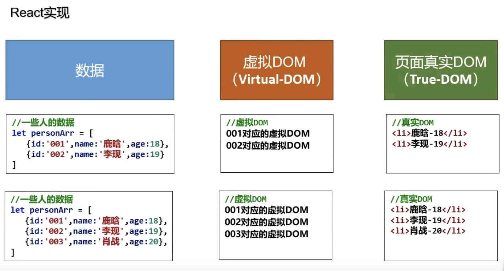

# React基本机制

#### React高效的原因：

1.使用虚拟DOM，不直接操作真实DOM

2.DOM Diffing算法，最小化页面重绘



------

`

#### 虚拟DOM的两种创建方式

​	**1. 纯JS方式，利用React库中createElement方法**

```js
// createElement (标签, 属性, 内容)
// 例如:
const VDOM = React.createElement('h2', {id: 'title'}, 'hello...')
```

​	**2. JSX，利用babel将JSX解析成JS**

```jsx
const VDOM = <h2 id:'title'>hello...<h2/>
```

------

`

#### 将虚拟DOM挂载在真实DOM上

```js
// ReactDOM.render(虚拟DOM，真实DOM)
ReactDOM.render(VDOM, document.getElementById('root'))
```

------

`

#### 相关JS库

1. react.js：React核心库。

2. react-dom.js：提供操作DOM的react扩展库。

3. babel.min.js：解析JSX语法代码转为JS代码的库。