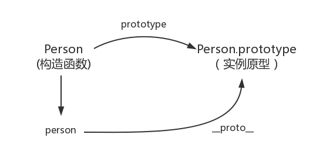
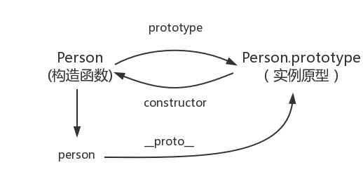

# 原型和原型链

#### prototype

每个函数都有prototype属性，

每一个`JavaScript对象`（null除外）在创建时会**关联另一个对象**，

这个对象就是我们所说的**「原型」**，

每一个对象都会**从原型“继承”属性**

```JavaScript
function Person() {}

// prototype是函数才会有的属性

Person.prototype.name = 'choi'
var person1 = new Person()
var person2 = new Person()
console.log(person1.name) // choi
console.log(person2.name) // choi
```


------

#### proto

每一个`JavaScript对象`(除了 null )都**具有的一个属性**，

叫**proto**，

这个属性会**指向该对象的原型**

```javascript
function Person() {}
var person = new Person()
console.log( person.__proto__ === Person.prototype ) // true

// 顺便学习一个ES5的方法,可以获得对象的原型
console.log(Object.getPrototypeOf(person) === Person.prototype) // true
```



------

#### construction

每一个`原型`都有一个construction指向**关联的构造函数**，

实例原型指向构造函数

```JavaScript
function Person() {}
console.log(Person === Person.prototype.construction) // true
```



------

#### 实例与原型

```JavaScript
// 当实例有name属性时，读取实例中的name属性
// 当实例没name属性时，读取原型中的name属性

function Person() {}

Person.prototype.name = 'Kevin';

var person = new Person();

person.name = 'Daisy';
console.log(person.name) // Daisy

delete person.name;
console.log(person.name) // Kevin
```


------

#### 原型与原型

```JavaScript
var obj = new Object();
obj.name = 'Kevin'
console.log(obj.name) // Kevin
```


------

#### 原型链

```JavaScript
console.log(Object.prototype.__proto__ === null) // true
```


JavaScript 默认并不会**复制**对象的属性，相反，JavaScript 只是在两个对象之间创建一个**关联**，

这样，一个对象就可以通过委托访问另一个对象的属性和函数，

所以与其叫继承，**委托**的说法反而更准确些