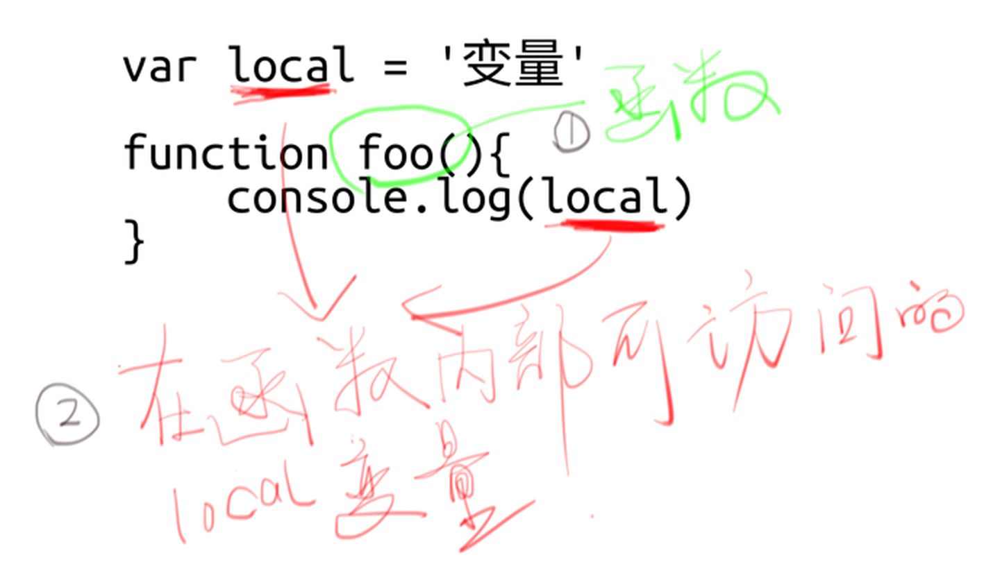

# 闭包

> **前言：**
>
> **编程界崇尚以简洁优雅为美，很多时候**
>
> **如果你觉得一个概念很复杂，那么很可能是你理解错了。**

`

**1 闭包的作用（优点）**

1）读取另一个函数作用域中的变量；

2）让这些变量**始终保持在内存**中，即闭包可以使得它诞生环境一直存在。

3）封装对象的私有属性和私有方法。（然后在全局作用域中通过调用闭包就能访问函数中的变量）

**2 闭包的缺点（坏处）**

由于闭包会携带包含它的函数的作用域，因此会比其他函数占用更多的内存，过度使用闭包可能会导致**内存占用过多**的问题。

所以不能滥用闭包，否则会造成网页的性能问题，在I**E中可能导致内存泄露**。

解决方法是，**在退出函数之前，将不使用的局部变量全部删除**。

`

**闭包的应用 — 循环中使用闭包解决 var 定义函数的问题**

```javascript
/*变量i是var命令声明的，在全局范围内都有效，所以全局只有一个变量i。
  每一次循环，变量i的值都会发生改变，而循环内setTimeout的回调函数中使用console.log(i)，
  里面的i指向的就是全局的i。
*/
 
  for( var i=1; i<=5; i++) {
    setTimeout( function timer() {
        console.log( i );
    }, i*1000);
 
}  //输出5个6
 
//因为 setTimeout 是个异步函数，所有会先把循环全部执行完毕，这时候 i 就是 6 了，所以会输出一堆 6。


/**************/
/* 闭包解决方案 */
/**************/
for (var i = 1; i <= 5; i++) {
    (function(j) {
        setTimeout(function timer() {
            console.log(j);
        }, j * 1000);
    })(i);
} //1 2 3 4 5(每行一个数字)


/**************/
/* 其他解决方案 */
/**************/
// 1. 使用 setTimeout 的第三个参数
for ( var i=1; i<=5; i++) {
    setTimeout( function timer(j) {
        console.log( j );
    }, i*1000, i);
}

// 2. 使用let
for ( let i=1; i<=5; i++) {
    setTimeout( function timer() {
        console.log( i );
    }, i*1000 );
}
```

`



```javascript
// 这里面确实有闭包，local 变量和 bar 函数就组成了一个闭包（Closure）。

function foo(){
  var local = 1
  function bar(){
    local++
    return local
  }
  return bar
}

var func = foo()
func()
```

`

#### 闭包的作用

闭包常常用来「**间接访问一个变量**」。换句话说，「**隐藏一个变量**」。

所以需要**局部变量**达到隐藏变量的目的。

`

> 闭包是 JS 函数作用域的副产品。
>
> 只要你懂了 JS 的作用域，你自然而然就懂了闭包，即使你不知道那就是闭包！

`

#### example

```javascript
// 假设在做一个游戏，lives为生命
// 使用局部变量来保证这个生命lives不被直接修改
// 暴露一个访问器（函数），让别人可以「间接访问」。

!function(){

  var lives = 50

  window.奖励一条命 = function(){
    lives += 1
  }

  window.死一条命 = function(){
    lives -= 1
  }

}()
```