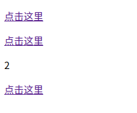

# Vue.extend 构造器的延伸

Vue.extend 返回的是一个“扩展实例构造器”,也就是预设了部分选项的Vue实例构造器。经常服务于Vue.component用来生成组件，可以简单理解为当在模板中遇到该组件名称作为标签的自定义元素时，会自动调用“扩展实例构造器”来生产组件实例，并挂载到自定义元素上。


**\### example ###**

html

```html
<div id="app">
    <extend-tag></extend-tag>
    <div class="test_class">1</div>
    <div class="test_class">2</div>
    <div id="test_class">3</div>
</div>
```

js

```javascript
var new_extend = Vue.extend({
    template:"<p><a :href='toUrl'>{{ click_here }}</a></p>",
    data:function(){
        return{
          toUrl: 'http://www.baidu.com',
          click_here: "点击这里"
        }
    }
})

// 挂载
new new_extend().$mount('extend-tag');
new new_extend().$mount('.test_class');
new new_extend().$mount('#test_class');
```

效果：

