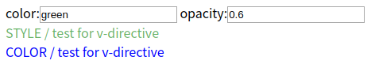

# Vue.directive 自定义指令


如果指令需要多个值，可以传入一个 JavaScript 对象字面量。

**记住，指令函数能够接受所有合法的 JavaScript 表达式。**


**# 自定义指令的生命周期：**

1. bind:只调用一次，指令第一次绑定到元素时调用，用这个钩子函数可以定义一个绑定时执行一次的初始化动作。
2. inserted:被绑定元素插入父节点时调用（父节点存在即可调用，不必存在于document中）。
3. update:被绑定于元素所在的模板更新时调用，而无论绑定值是否变化。通过比较更新前后的绑定值，可以忽略不必要的模板更新。
4. componentUpdated:被绑定元素所在模板完成一次更新周期时调用。
5. unbind:只调用一次，指令与元素解绑时调用。


**### example ###**

视图层

```html
color:<input type="text" v-model="color">
opacity:<input type="text" v-model="opacity">

<div v-change-color="color">COLOR / test for v-directive</div>
<div v-change-style="{ color:color, opacity:opacity }">STYLE / test for v-directive</div>
```

逻辑层

```javascript
/* 
                el: 指令所绑定的元素，可以用来直接操作DOM
                binding: 一个对象，包含该指令的很多信息
                vnode: Vue编译生成的虚拟节点 
*/

// 全局定义自定义命令
Vue.directive('change-color',{
   inserted: function(el,binding,vnode){
      el.style = 'color:' + binding.value;
    }
})

Vue.directive('change-style',function(el,binding,vnode){
  el.style = 
    'color:' + binding.value.color + ';' +
    'opacity:'+ binding.value.opacity;
})

// 创建vue实例
var vm=new Vue({
  el: '#app',
  data:{  //数据
    color: 'blue',   // 颜色
    opacity: 1  // 透明度
  },
})
```

效果：*（ 由于生命周期所以第二行没改变颜色）*




